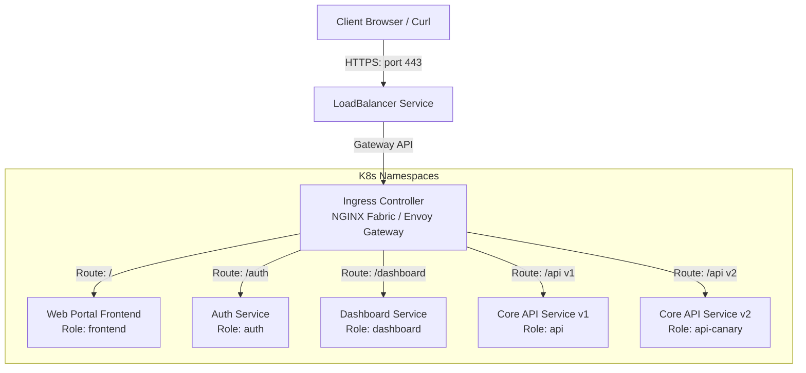
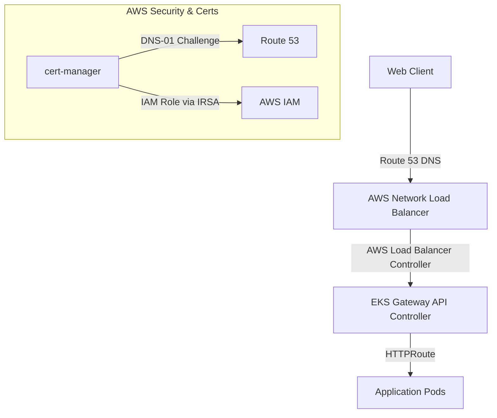
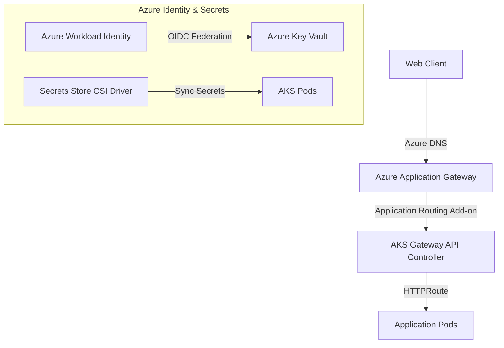

# Master Interview Study Guide: Modernizing 3-Tier Web Apps on Kubernetes
## Includes Local Minikube, AWS EKS, and Azure AKS Architectures

This guide provides a comprehensive overview of the architecture, technical decisions, and challenges solved during the local migration of the **Apex Bank (Fincoro)** and **MediCenter (Hospital)** applications, as well as how this exact setup scales into production-grade environments on **AWS EKS** and **Azure AKS**.

---

## 🏛️ Local Project Architecture (Minikube)

You successfully migrated and ran two enterprise-grade, three-tier applications from a static **Kind/MetalLB** cluster to a dynamic **Minikube** cluster using **ArgoCD (GitOps)**:

1. **Apex Bank (Fincoro App)**: A secure banking application using **NGINX Gateway Fabric** for ingress routing.
2. **MediCenter (Hospital App)**: A hospital management portal using **Envoy Gateway** for ingress routing.

Both applications share a modern, three-tier microservice architecture:



### Key Local Challenges Solved
* **ArgoCD Kustomize Load Restriction**: Resolved ArgoCD `ComparisonError` failures by nesting certificate and gateway manifests directly within the application directories (`fincoro-app/` and `hospital-app/`), avoiding parent directory (`../`) traversals.
- **CRD Bootstrapping Order**: Installed cert-manager, Gateway API, NGINX Gateway Fabric, and Envoy Gateway CRDs before syncing resource manifests.
- **Minikube Dynamic Load Balancer Integration**: Replaced static IPs with native LoadBalancer services (`minikube tunnel`) to assign IP addresses dynamically.
- **Local Image Loading**: Loaded the custom `fincoro-app:latest` image directly into Minikube's image cache (`minikube image load`).

---

## ☁️ Production Architecture: AWS EKS

In a production environment on **AWS EKS**, static configurations are replaced by native cloud integrations.



### 1. Ingress & Load Balancing
* **AWS Load Balancer Controller (ALBC)**: Manages Network Load Balancers (NLB) or Application Load Balancers (ALB) dynamically when `Gateway` resources are declared.
* **Service Type**: The gateway controller provisions an AWS NLB in **IP target mode**, routing traffic directly from the NLB to the pod IPs, bypassing the latency of kube-proxy routing.

### 2. DNS & Domain Mapping
* **ExternalDNS**: Dynamically synchronizes Kubernetes `HTTPRoute` hostnames (e.g. `api.apex.local` -> `api.fincoro.com`) with **AWS Route 53** hosted zones, automating record creation and deletion.

### 3. Certificate Management & Security
* **cert-manager + Let's Encrypt (DNS-01)**: Automates TLS. To prove ownership of the domain without exposing API keys, cert-manager uses **IAM Roles for Service Accounts (IRSA)** to temporarily assume an AWS IAM role and update DNS TXT records in Route 53.
* **Alternative (AWS Certificate Manager)**: Integrate ACM directly with the NLB, offloading TLS termination at the AWS infrastructure layer instead of the cluster.

---

## ☁️ Production Architecture: Azure AKS

In a production environment on **Azure AKS**, the deployment utilizes native Azure Resource Manager integrations.



### 1. Ingress & Load Balancing
* **AKS Application Routing Add-on**: A managed controller (often based on NGINX or Application Gateway Ingress/Gateway API) that dynamically provisions **Azure Application Gateway** or **Azure Load Balancers**.
* **Azure CNI**: Pods receive native IP addresses from the Azure Virtual Network (VNet), allowing the Azure Application Gateway to route traffic directly to pods.

### 2. DNS & Domain Mapping
* **ExternalDNS**: Configured with Azure Managed Identity to automatically synchronize Kubernetes hostnames with **Azure DNS Zones**.

### 3. Secrets & Certificate Management
* **Azure Key Vault (AKV) + Secrets Store CSI Driver**: Certificates are stored securely in AKV. The CSI Driver mounts these certificates as local volumes inside pods or maps them to Kubernetes TLS secrets automatically.
* **Azure Workload Identity**: Eliminates long-lived service principal client secrets. Kubernetes ServiceAccounts federate with Azure Active Directory (AAD) using OIDC token exchange to access Key Vault securely.

---

## 🛠️ Production Improvisations (How to Elevate the Architecture)

If asked: *"How would you improve this system for a highly secure production deployment?"*, mention these five pillars:

1. **Security Contexts & Least Privilege**:
   - Set `runAsNonRoot: true`, `runAsUser: 10001`, and `readOnlyRootFilesystem: true` in Pod specifications.
   - Strip unnecessary Linux capabilities (e.g. `capabilities: drop: ["ALL"]`).
2. **Network Policies**:
   - Limit ingress/egress to microservices (e.g. restrict `user-console` dashboard so it cannot communicate directly with the database, restricting access only to backend `core-api`).
3. **Resource Requests & Limits**:
   - Set CPU/Memory Requests and Limits for all pods to prevent CPU starvation and out-of-memory (OOM) kills.
4. **Liveness & Readiness Probes**:
   - Add HTTP or TCP health probes to prevent traffic routing to uninitialized or broken pods.
5. **ConfigMaps/Secrets Separation**:
   - Remove hardcoded environment variables. Inject sensitive database credentials or authentication keys using Kubernetes Secrets.

---

## 🚀 Complete Step-by-Step Setup Guide (From Scratch)

Follow these exact steps to rebuild and run both applications from scratch on a clean machine:

### Step 1: Start Minikube
```bash
minikube start --driver=docker
```

### Step 2: Build & Cache the Application Image
```bash
# Build the application image locally
docker build -t fincoro-app:latest app/

# Load the image into Minikube's local container registry
minikube image load fincoro-app:latest
```

### Step 3: Install CRDs & Operators
```bash
# 1. Install standard Gateway API CRDs
kubectl apply -f https://github.com/kubernetes-sigs/gateway-api/releases/download/v1.0.0/standard-install.yaml

# 2. Install cert-manager
helm repo add jetstack https://charts.jetstack.io
helm repo update
helm install cert-manager jetstack/cert-manager \
  --namespace cert-manager \
  --create-namespace \
  --version v1.13.1 \
  --set installCRDs=true

# 3. Install NGINX Gateway Fabric Controller & CRDs
kubectl apply -f https://github.com/nginxinc/nginx-gateway-fabric/releases/download/v1.1.0/crds.yaml
kubectl apply -f https://raw.githubusercontent.com/nginxinc/nginx-gateway-fabric/v1.1.0/deploy/manifests/nginx-gateway.yaml
kubectl apply -f https://raw.githubusercontent.com/nginxinc/nginx-gateway-fabric/v1.1.0/deploy/manifests/service/loadbalancer.yaml

# 4. Install Envoy Gateway
helm install eg oci://docker.io/envoyproxy/gateway-helm \
  --version v1.0.1 \
  -n envoy-gateway-system \
  --create-namespace
```

### Step 4: Install ArgoCD
```bash
kubectl create namespace argocd
kubectl apply -n argocd -f https://raw.githubusercontent.com/argoproj/argo-cd/stable/manifests/install.yaml

# Wait for ArgoCD components to be ready
kubectl wait --namespace argocd --for=condition=ready pod --selector=app.kubernetes.io/name=argocd-server --timeout=90s
```

### Step 5: Apply ArgoCD Applications
```bash
# Apply shared infrastructure bootstrap (ClusterIssuer)
kubectl apply -f argocd/infra-bootstrap.yaml

# Wait a moment, then apply the microservices applications
kubectl apply -f argocd/fincoro-app.yaml
kubectl apply -f argocd/hospital-app.yaml
```

### Step 6: Activate Tunnel & Update Hosts
1. Start the tunnel in a separate window:
   ```bash
   minikube tunnel
   ```
2. Find the external IPs:
   ```bash
   kubectl get svc -A | grep LoadBalancer
   ```
3. Update `/etc/hosts`:
   ```bash
   sudo nano /etc/hosts
   ```
   Add the IPs matching `nginx-gateway` and the `envoy-hospital-system-...` services.

---

## 💬 Practice Q&A for Cloud Interviews (EKS & AKS)

### AWS EKS Interview Questions

#### Q: How do you configure EKS pods to access AWS services securely without using hardcoded access keys?
> **Answer**: I implement **IAM Roles for Service Accounts (IRSA)**. 
> 1. Set up an OpenID Connect (OIDC) provider for the EKS cluster.
> 2. Create an AWS IAM role with the required policies (e.g. Route 53 access for cert-manager).
> 3. Establish a trust relationship between the IAM role and the Kubernetes ServiceAccount.
> 4. Annotate the ServiceAccount with the IAM Role ARN. The EKS pod mutating webhook will automatically inject AWS credentials/tokens into the pod.

#### Q: What is the difference between Instance mode and IP mode for AWS Load Balancers, and which one would you choose?
> **Answer**: 
> - **Instance Mode**: Traffic routes from the NLB/ALB to the NodePorts of the cluster nodes, which then use kube-proxy (iptables/IPVS) to route to the pods. This introduces an extra network hop.
> - **IP Mode**: The AWS Load Balancer Controller routes traffic directly to the pod IP addresses. I would choose **IP Mode** for this microservice architecture because it bypasses kube-proxy, reducing latency and avoiding uneven traffic distribution. It requires the AWS VPC CNI to ensure pods have routable VPC IPs.

---

### Azure AKS Interview Questions

#### Q: How does Azure Workload Identity work in AKS, and how does it replace legacy Managed Identities?
> **Answer**: Azure Workload Identity utilizes **OIDC Federation**.
> 1. AKS acts as an OIDC token issuer.
> 2. A Kubernetes ServiceAccount token is projected into the pod.
> 3. The pod exchanges this Kubernetes token with Azure AD (Microsoft Entra ID) for an Azure access token.
> 4. Use of Workload Identity is standards-based, faster, and operates at the SDK level inside the application container, making it more secure and compatible with non-Linux node pools.

#### Q: How would you secure and automate certificate updates for an AKS application using Azure Key Vault?
> **Answer**: I would use the **Secrets Store CSI Driver** with the Azure Key Vault provider:
> 1. Store the wildcard TLS certificates in Azure Key Vault.
> 2. Configure a `SecretProviderClass` in AKS defining the vault name and certificates to pull.
> 3. Mount the CSI volume in the Gateway/Ingress deployment and enable `secretObjects` syncing to dynamically generate a Kubernetes `v1/Secret` of type `kubernetes.io/tls`.
> 4. Enable **autorotation** on the CSI driver so that when a certificate is renewed in Key Vault, AKS pulls the updated certificate and hot-reloads the gateway proxy without downtime.
